# BQ App

## 🎯 Project Objective

A Node + Express + Front-end rendering React with Hooks + Mongo web app that helps users prepare for behavioral interviews (“BQ”) by practicing common questions across professional tracks. Users can log in, get a random interview question, type their answer, and compare it with a suggested answer to self-evaluate.

## 📥 Installation & Usage

```bash
# Clone the repo
git clone https://github.com/zhuoyumiao/BQapp.git
cd BQapp

# Create a .env file in the root directory:
PORT=3000
MONGODB_URI=<your Mongo connection string>
DB_NAME=<your db name>

# If dependencies exist (optional)
cd server
npm install
cd ..
cd client
npm install

# run server
cd ..
npm run start:server

# run client
npm run start:client
```

---

---

## ⚙️ Tech Requirements

- HTML5, CSS3, JavaScript, Node, Express, Mongo, React
- Node.js >= 20
- ESLint + Prettier for code linting and formatting
- Git + GitHub for version control and hosting

---

## 👩‍💻 Author & Link

Author: Zhuoyu Miao & Muchen Qi

---

## 📚 Reference to the Class

This project was created as part of the **CS5610 Web Development** course at Northeastern University. https://johnguerra.co/classes/webDevelopment_online_fall_2025/

---

## 📝 Resources:

Website Link: https://bqapp-atbn.onrender.com

Design document: https://docs.google.com/document/d/13b1pRa5lO_Lp83we7CcGD8SsMKdpSByGaRUvohujUd8/edit?usp=sharing

Link of video demonstration: https://youtu.be/Gxh7GaRYKqA

Demonstration slide: https://docs.google.com/presentation/d/1yPdMrg6ghoRJOeVwAYid0qSpqgIZcGdApc79RfqnqT0/edit?usp=sharing

---

## 📸 Demo

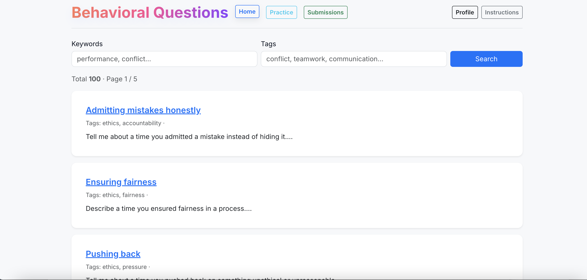
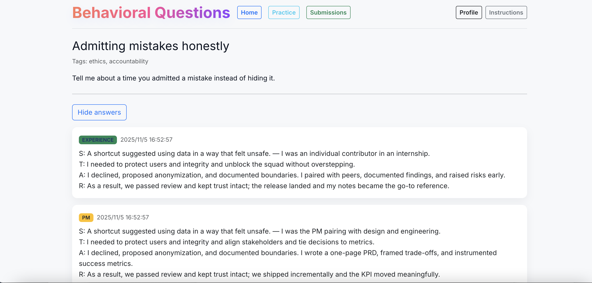
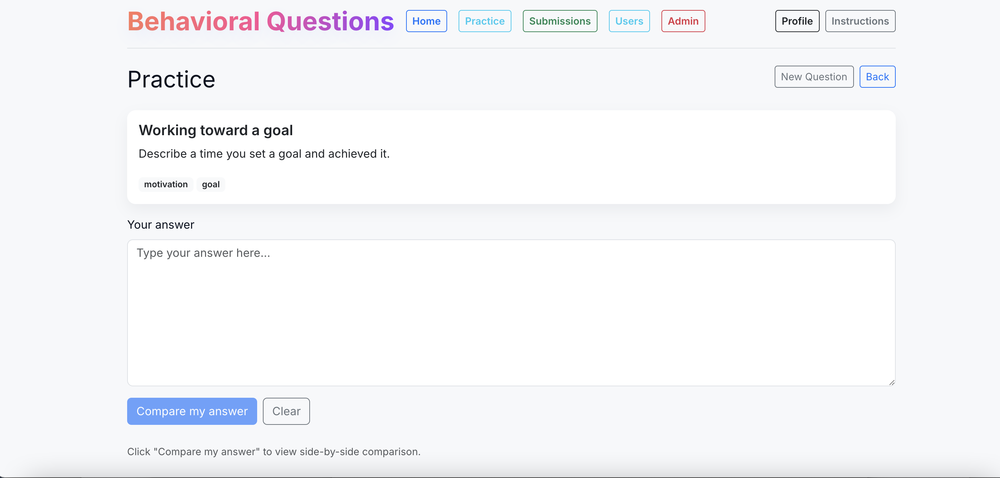

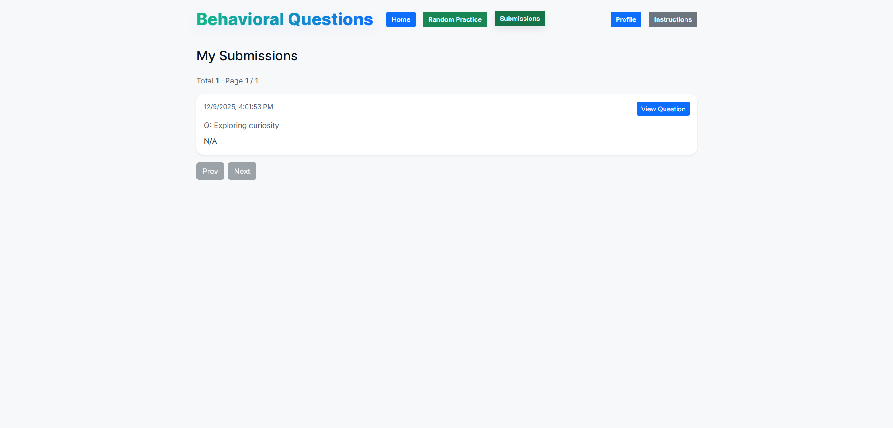
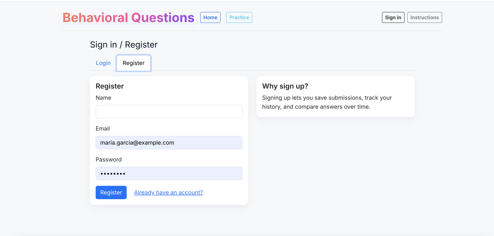
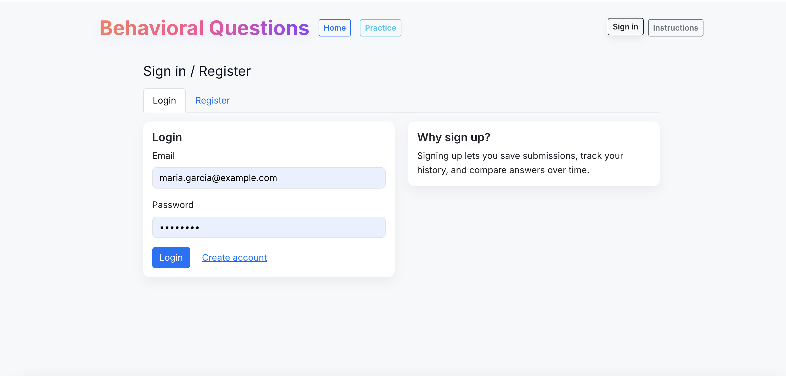
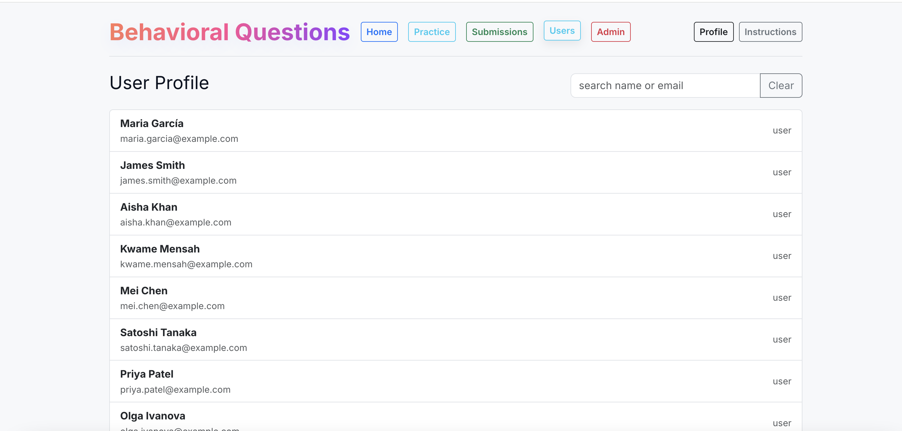
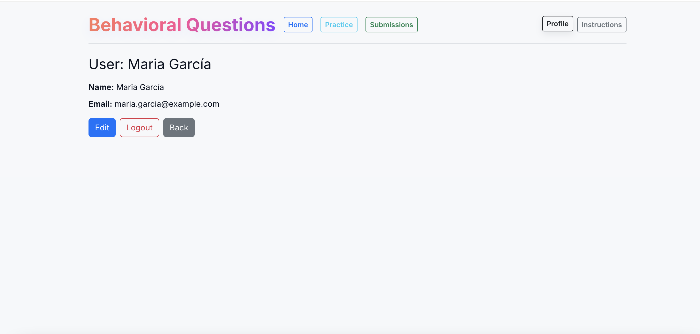
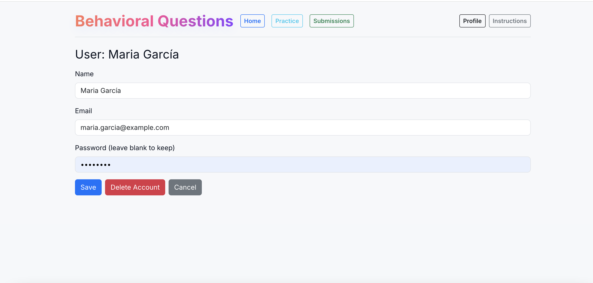
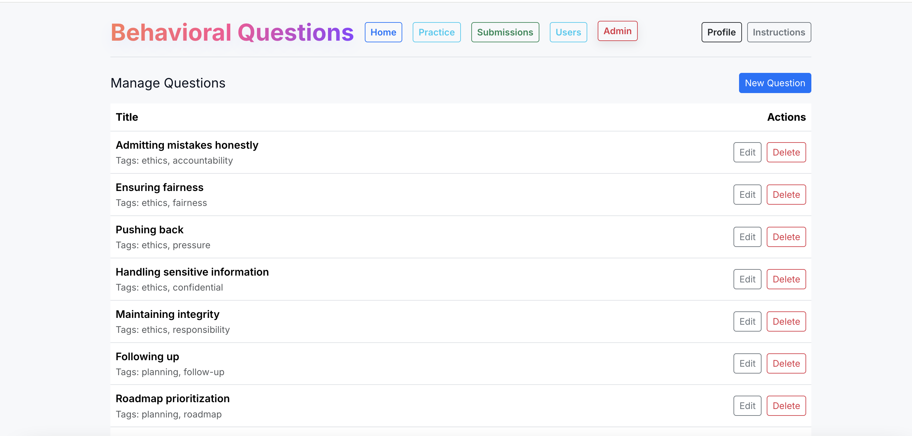
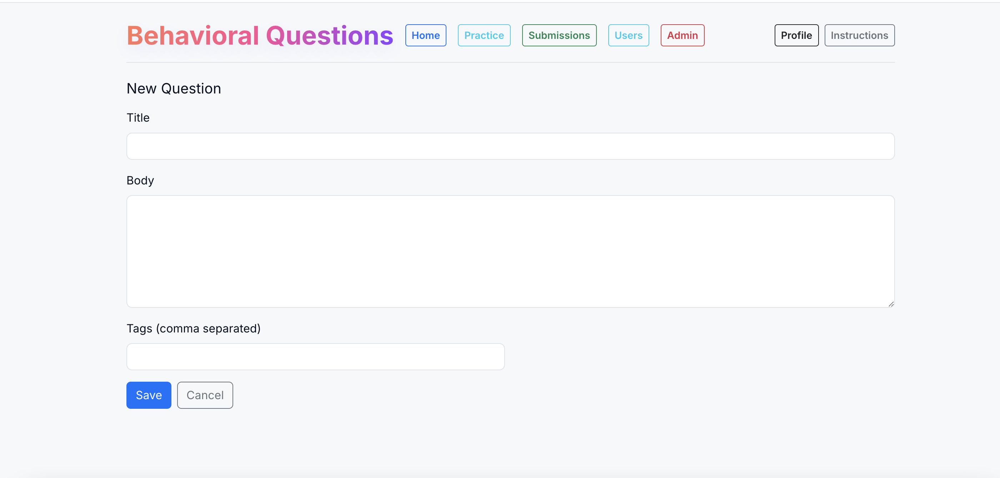
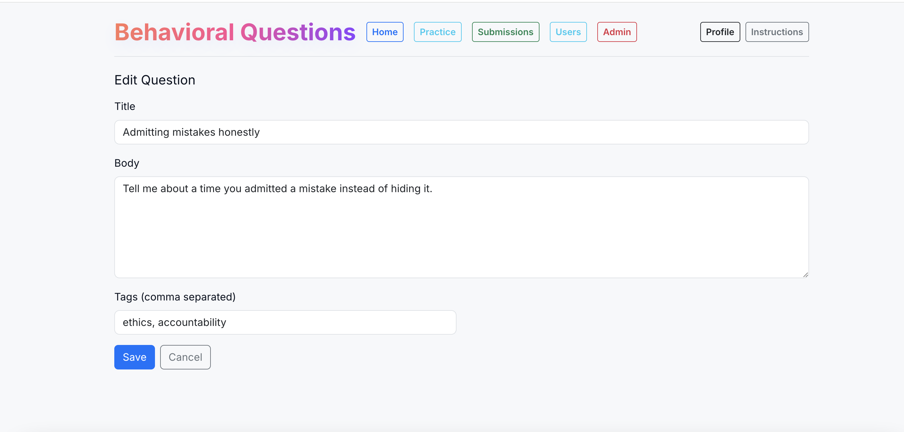

---

## Database records

There are (100question + 100 _ 4answers) + (20 _ 25 attempt) + 20users = 1020 records in total
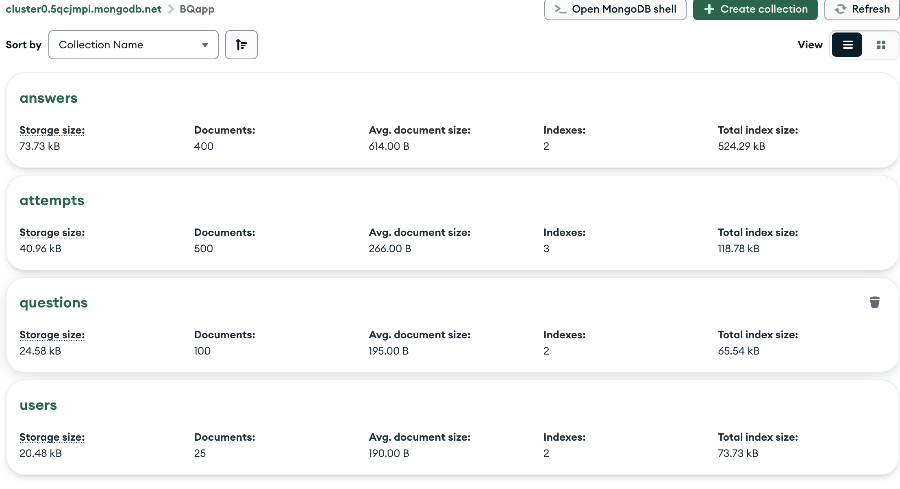

---

## CRUD operations

User(Muchen Qi) and Question(Zhuoyu Miao) have CRUD operations supported.

---

## Instructions to use

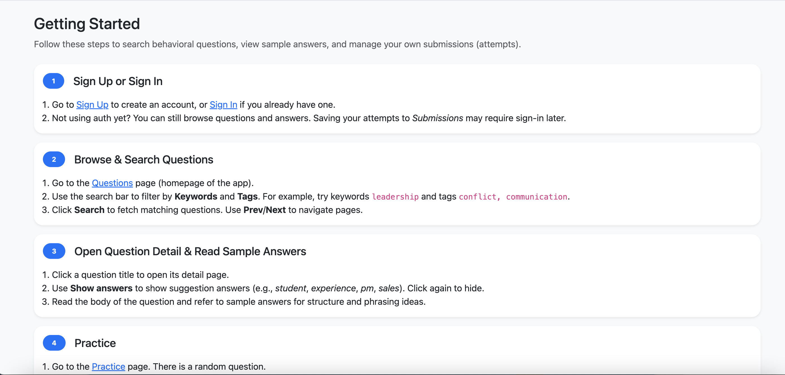

## React Components (using hooks)

Questions.jsx, QuestionDetail.jsx, AttemptDetail.jsx...

## Usability Report

https://docs.google.com/document/d/1rMZvf8cGGINKWit7XsCMiMC-6uxYadj72-zo4NImtOU/edit?usp=sharing

## Colors

The app uses a semantic and consistent color system to ensure clarity and usability:

- Blue (Primary): Used for general navigation and standard actions such as Home, Users, Profile, and Search. It represents reliability and professionalism.
- Green (Secondary): Used for primary task actions like Random Practice and Submissions, indicating progress and positive action.
- Red (Semantic): Reserved for high-risk administrative actions (Admin) to prevent accidental misuse.
- Gray (Secondary/Informational): Used for secondary actions such as Instructions.

## 🤖 AI usage

Used ChatGPT to help create useHashRoute.js. Used the GPT-5 and prompt "create useHashRoute file for frontend react app".
Used ChatGPT to help generate sample answers. Used the GPT-5 and prompt "generate sample answers according to my questions".
